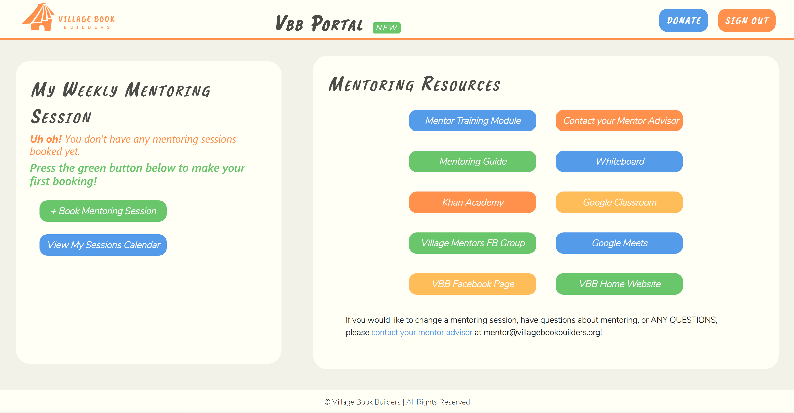
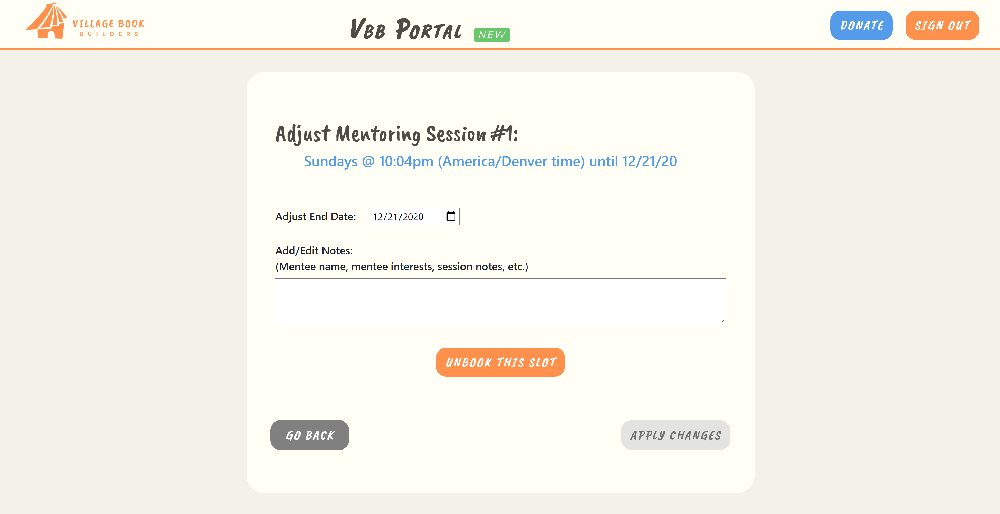

# VBB Portal - A portal for booking interational tutoring sessions ✈

**Created by Village Book Builders, used by Nike and Oracle**

This was the project I worked on while interning at VBB (Village Book Builders) as a Full Stack Developer.

Although I did both front-end and back-end, my efforts were primarily focused on the front-end. We used ReactJS on the front-end then Django (a Python web development framework) on the back-end. This website was originally active but has since been deprecated, but with the permission of VBB I was able to recreate the front-end to showcase as part of my portfolio.

_Keep in mind that while at one point the app was fully integrated with a backend as far as authentication and appointment booking, it now just doesn't have authentication so anyone can view the website, and appointment booking is stored using simply just local storage._
